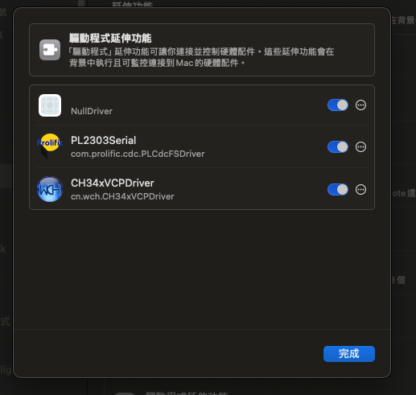

# CH34x 驅動安裝與 ESP 燒錄問題排除指南

## MacOS CH34x 驅動安裝與 ESP 燒錄問題排除指南

### 步驟 1：安裝 CH34x 驅動程式

- 下載 WCH 官方提供的驅動：
  - 下載鏈接: CH34x macOS 驅動
- 解壓縮後，根據你的 macOS 版本選擇合適的安裝方式：
  - macOS 10.9 - 10.15：執行 .pkg 安裝檔案，並依照指示完成安裝。
  - macOS 11.0 及以上：
    - 若你的 macOS 不支援 Rosetta，請安裝 .dmg 版本驅動程式：
    - 下載並打開 .dmg 安裝包。
    - 拖曳 CH34xVCPDriver 至「應用程式」資料夾。
    - 透過「LaunchPad」找到 CH34xVCPDriver 應用程式，點擊「安裝」按鈕完成安裝。


### 步驟 2：檢查 tty.wch 串口號

- 插入 CH34x USB 轉串口設備。
- 開啟「終端機」（Terminal），輸入：
```sh
ls /dev/tty.*
```
- 如果出現 `/dev/tty.wchusbserialX`（X 為數字），則驅動已正常載入。

### 步驟 3：確認驅動是否已啟用

如果 步驟 2 沒有出現 tty.wchusbserialX，請執行以下操作：

- 進入 系統設定 > 一般 > 延伸功能 > 驅動程式延伸功能。




- 確保 CH34xVCPDriver 已啟用（如圖示）。
- 若未啟用，請手動開啟後 重新插入設備，並重試 `ls /dev/tty.*`。

### 步驟 4：授權未簽名驅動

如果設備仍無法識別，可能是 macOS 阻擋了未簽名的驅動：

- 進入 系統設定 > 安全性與隱私 > 一般。
- 若看到「允許來自 'WCH' 的應用程式」，請點擊「允許」並重新啟動 Mac。

### 步驟 5：嘗試燒錄 ESP

確保 esptool.py 可以運行：
```sh
python3 -m pip install esptool
```

重新執行燒錄指令：
```sh
esptool.py --port /dev/tty.wchusbserialX write_flash 0x1000 firmware.bin
```

若仍然出現 `Failed to write to target RAM (result was 01070000: Operation timed out)`：

- 嘗試降低波特率：
```sh
esptool.py --port /dev/tty.wchusbserialX --baud 115200 write_flash 0x1000 firmware.bin
```
- 確認設備未佔用：
```sh
lsof | grep tty.wch
```
- 若有其他程式佔用，請結束該程式後重試。

### 步驟 6：重裝驅動（若仍然失敗）

移除舊驅動
```sh
sudo rm -rf /Library/Extensions/CH34xVCPDriver.kext
sudo rm -rf /var/db/receipts/*CH34xVCPDriver*.*
```
重新啟動電腦後，重新安裝 CH34x 驅動。

---

# CH34x Driver Installation and ESP Flashing Troubleshooting Guide

## MacOS CH34x Driver Installation and ESP Flashing Troubleshooting Guide

### Step 1: Install CH34x Driver

- Download the official driver from WCH:
  - Download link: CH34x macOS driver
- After extracting, choose the appropriate installation method based on your macOS version:
  - macOS 10.9 - 10.15: Run the .pkg installer file and follow the instructions.
  - macOS 11.0 and above:
    - If your macOS doesn't support Rosetta, install the .dmg version of the driver:
    - Download and open the .dmg package.
    - Drag CH34xVCPDriver to the Applications folder.
    - Find the CH34xVCPDriver application in LaunchPad and click "Install" to complete the installation.

### Step 2: Check tty.wch Serial Port

- Plug in the CH34x USB to serial device.
- Open Terminal and enter:
```sh
ls /dev/tty.*
```
- If `/dev/tty.wchusbserialX` (where X is a number) appears, the driver has loaded successfully.

### Step 3: Verify Driver is Enabled

If Step 2 doesn't show tty.wchusbserialX, perform the following:

- Go to System Settings > General > Extensions > Driver Extensions.
- Make sure CH34xVCPDriver is enabled (as shown in the image).
- If not enabled, manually enable it, reconnect the device, and retry `ls /dev/tty.*`.

### Step 4: Authorize Unsigned Drivers

If the device still isn't recognized, macOS may be blocking unsigned drivers:

- Go to System Settings > Security & Privacy > General.


- If you see "Allow apps from 'WCH'", click "Allow" and restart your Mac.

### Step 5: Attempt to Flash ESP

Make sure esptool.py is installed:
```sh
python3 -m pip install esptool
```

Run the flashing command again:
```sh
esptool.py --port /dev/tty.wchusbserialX write_flash 0x1000 firmware.bin
```

If you still receive `Failed to write to target RAM (result was 01070000: Operation timed out)`:

- Try reducing the baud rate:
```sh
esptool.py --port /dev/tty.wchusbserialX --baud 115200 write_flash 0x1000 firmware.bin
```
- Check if the device is in use by another program:
```sh
lsof | grep tty.wch
```
- If another program is using it, close that program and try again.

### Step 6: Reinstall Driver (if still failing)

Remove the old driver:
```sh
sudo rm -rf /Library/Extensions/CH34xVCPDriver.kext
sudo rm -rf /var/db/receipts/*CH34xVCPDriver*.*
```
Restart your computer, then reinstall the CH34x driver.
